# Shumba Valeting

Shumba valeting is a **Full Stack Django website** designed for **car valeting services**.  
The site allows customers to explore valet packages, make/edit bookings, and contact the business.  
The site has a complete CRUD implementation, responsive design, and database modelling, with an emphasis on a **professional, luxury user experience**.

The site can be accessed by this [link](https://shumba-app-20d8670cc25d.herokuapp.com/)

## User Experience (UX)

### User Stories

**As a site user, I want to be able to:**
- Easily view valet services, so that I can choose the right service for my car.  
- Make an online or whatsapp message booking, so that I don’t need to phone the company.  
- Receive confirmation and feedback messages when I submit a booking or contact form.  
- Navigate smoothly across all pages on desktop and mobile, so that I can use the site anywhere.  

**As a site owner, I want to be able to:**
- Add, edit, and delete bookings, so that the business can stay up to date.  
- Receive booking requests and customer inquiries directly through the site.  
- Ensure the system validates user input when booking services, so there are no duplicate bookings 
- Provide customers with clear, professional branding in line with Shumba Valeting.  

---

### Purpose and Value of Shumba Valeting to users: 

Designed the site so the purpose of the site is **clear to first-time visitors**: it is a **car valeting booking and information platform**, targeting **high-end car owners** who want convenience, professionalism, and a luxury service.  

### Colour Scheme
- **Black** – luxury, premium feel  
- **Silver/Grey** – professional, modern tone  
- **White** – clean readability  

### Typography
- **Playfair Display** (headings, luxury branding)  
- **Sans-serif fallback** (body text for readability)  

### Imagery
- High-quality imagery of valeting services is used across the Services page.  
- Each valet package has a dedicated image for visual clarity.  

# Project Features

---

##  Navigation Bar

- Placed at the top of every page, with links to **Home**, **Services**, **Contact**, **Sign up**, **login** and **Booking**.  
- Fully responsive across desktop and mobile.  
- On mobile, the navigation bar collapses into a **burger menu** for easier navigation.  

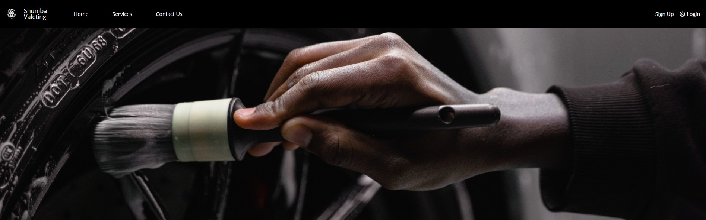

---

##  Home Page

**Features:**

- Brand introduction with clear messaging.  
-  Call-to-action buttons directing users to the **Booking** form.  

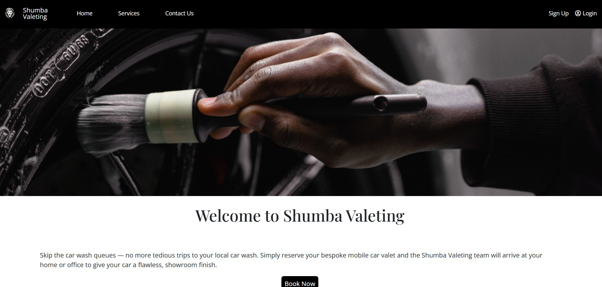

---

##  Services Page

**Features:**

- Displays valet packages: **Basic, Premium, Executive, Luxury**.  
- Each package includes descriptions, pricing, and images.  

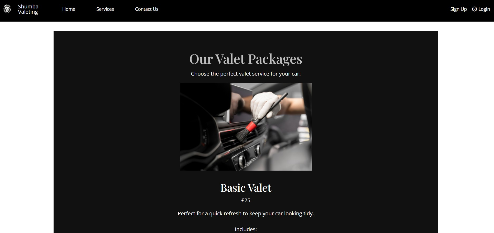

---

##  Contact Page

**Features:**

- Contact form with fields for user details.  
- Submit button to send user inquiries.  

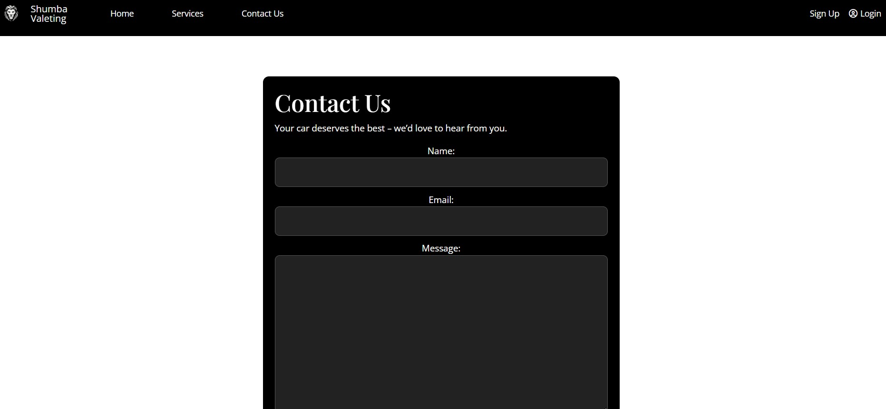

---

##  Booking Page

**Features:**

- Booking form connected to the database.  
- Prevents **duplicate time slots** from being booked.  
- Provides **success/error feedback** upon submission.  
- Allows users to cancel bookings or go to the editing page 

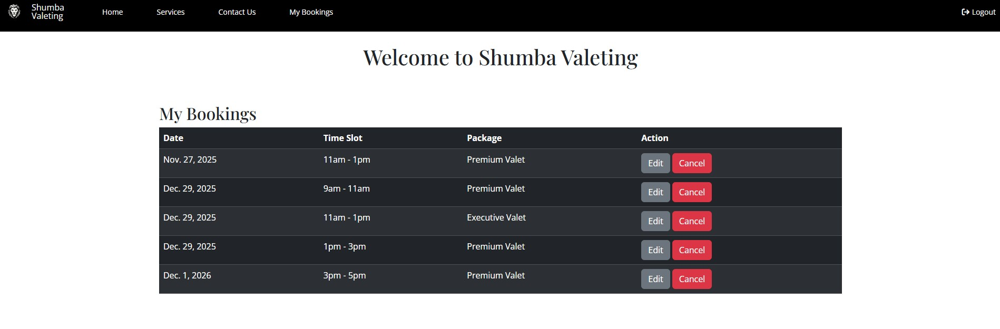

## Edit Page

**Features:**

- Allows admins or authenticated users to modify existing bookings.
- Validates updated date, time slot, and service package.
- Prevents booking conflicts (date + time_slot).
- Saves changes and provides clear success/error feedback.

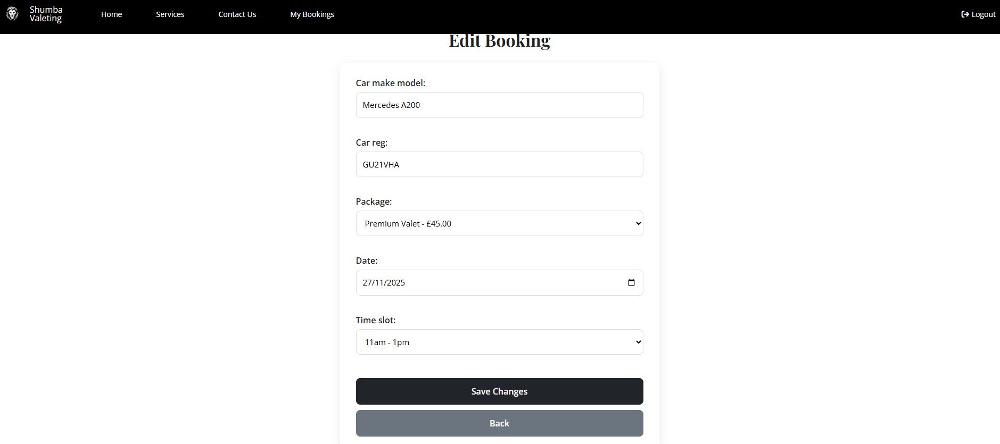

---

- **CRUD Operations**:  

  - **Create**: Bookings and messages.  
  - **Read**: Services and bookings.  
  - **Update**: Admin  / user updates bookings. 
  - **Delete**: Admin / user deletes bookings.  
- **User Feedback**: Django messages framework provides alerts (e.g., “Booking confirmed”, “Time slot already taken”).  
- **Responsive Design**: Works seamlessly across desktops, tablets, and mobiles.  

### Future features to Implement
- Online payments 
- SMS/email booking notifications once bookings are made. 
- Testimonials page.  

## Database Schema

The system uses Django ORM with models mapped to **SQLite (development)** / **PostgreSQL (production)**.

### Models

**Contact**
- `name` (CharField)  
- `email` (EmailField)  
- `message` (TextField)  

**Booking**
- `user` (ForeignKey to Django User, optional for guests)  
- `date` (DateField)  
- `time_slot` (CharField / TimeField)  
- `package` (ForeignKey to Service)  
- **Unique constraint** on date + time_slot  

**Service**
- `title` (CharField)  
- `description` (TextField)  
- `price` (DecimalField)  
- `image` (ImageField)  

### Schema Characteristics 
- One-to-many: `User → Bookings`, `Service → Bookings`.  
- Centralised config in `settings.py`.  
- Schema matches business needs (car valeting domain).  

---

## Testing

### Manual Testing
- Forms tested with valid/invalid inputs. Validation errors display correctly.  
- Duplicate booking attempts rejected gracefully with error message.  

### CRUD Testing
- Added, updated, and deleted bookings. 
- Verified CRUD operations reflected immediately in UI.  

### Responsive Testing
- Tested on desktop, tablet, and mobile (Chrome DevTools).  
- Grid layout adapts correctly.  

### Browser Testing
- Works in Chrome, Firefox, Safari, Edge.  

### Accessibility
- Checked colour contrast with Lighthouse.  
- Semantic HTML (headings, lists, alt text).  

---

## 🛠️ Development Process

- **Version control**: Git & GitHub.  
- **Process followed**:  
  1. Planning (wireframes, schema design, UX goals).  
  2. Setup (Django project, models, apps, templates).  
  3. Implementation (CRUD, forms, feedback).  
  4. Styling (CSS branding).  
  5. Testing (manual and validation).  
  6. Deployment (local + Heroku).  

---

## Deployment

### Local Deployment
git clone https://github.com/MunasheMuk2/Shumba_valeting.git
cd shumba-valeting
python -m venv venv
venv\Scripts\activate      
pip install -r requirements.txt
python manage.py migrate
python manage.py createsuperuser
python manage.py runserver

---

## Remote Deployment (Heroku)

- Deployed with **Heroku**, using **PostgreSQL** as the database.  
- `Procfile` and `requirements.txt` included for deployment.  
- Environment variables managed in **Heroku Config Vars**.  
- `DEBUG = False` in production for security.  

---

## Security

- Used **SECRET_KEY** 
- `.gitignore` excludes sensitive files.  
- `DEBUG` disabled in production.  

---

### Media
- Free images from [Unsplash](https://unsplash.com)  

---

#  Technologies Used
- **Django** –  framework  models, forms, routing, and admin  
- **Python** – Core application logic, form validation, and utilities  
- **PostgreSQL (Heroku)** – Production database  
- **SQLite** – Local development database  
- **HTML5 / CSS / Bootstrap** – Front-end styling and responsive layouts  
- **VSCode** – Primary code editor  
- **Git & GitHub** – Version control and repository hosting  
- **Heroku** – Deployment platform  
- **Django Messages Framework** – For success/error feedback  

---

#  Testing

### Manual Testing
- All forms (Booking, Edit, Contact, Admin CRUD) tested with valid and invalid  inputs  
- Verified duplicate slots cannot be saved  
- Checked success/error messages for all form submissions  
- Confirmed all CRUD operations work through Django Admin  
- Tested responsiveness on mobile, tablet, and desktop breakpoints  
 

### Browser Compatibility
Tested on:
- Chrome (latest)  
- Firefox (latest)  
- Edge (latest)  
- Safari (Mac/iOS)  

 All major user flows worked as expected  

---

---

### Code References

- Code Institute learning materials  
-  YouTube tutorials for forms, CRUD, and admin configuration  - Tech with Tim

- [Medium.com](https://medium.com/@iamalisaleh/implementing-messaging-functionality-with-the-messages-framework-in-django-23d7afc8f1d2) - django messages framework
- [VSCode](https://code.visualstudio.com/)  django models
- [W3schools](https://www.w3schools.com) - Django views
- [Programik](https://www.programink.com/django-tutorial/django-urls-views.html) - Django urls

---

### Unsolved bugs

1. Although the favicon files exist in the correct directory and load correctly in development, the favicon does not consistently display on the deployed Heroku version of the site. All file paths, template tags, and static settings are correctly configured.
The exact cause is still unclear, but it may be related to browser caching. The site continues to function normally despite this. 

---

#  Solved Bugs
1. **Booking “duplicate time slot” not being caught**  
  Fixed by adding a unique constraint on `date + time_slot` in the Booking model  

2.  **Navbar spacing breaking on mobile**  
  Fixed using Bootstrap’s responsive classes (`navbar-expand`, flex alignment utilities)  

3.  **Forms not showing inline validation errors**  
  Corrected by using `{{ form.non_field_errors }}` and `{{ field.errors }}` in templates  

---

### Wireframe

- [Wireframe link](https://www.canva.com/design/DAGvX6KVp-M/upj4EZBvLCK6ELGOqwWtQg/edit?utm_content=DAGvX6KVp-M&utm_campaign=designshare&utm_medium=link2&utm_source=sharebutton)

---

## Testing

## Compatibility

In order to confirm the correct functionality, responsiveness, and appearance:

+ The website was tested on popular browsers : Chrome and Microsoft edge

    - Chrome:

    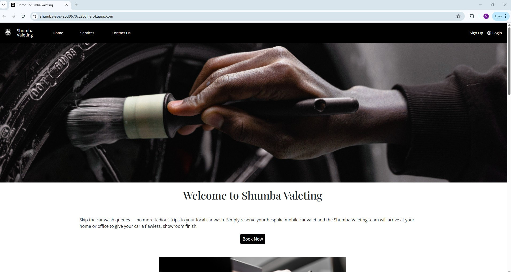

     - Microsoft Edge:

    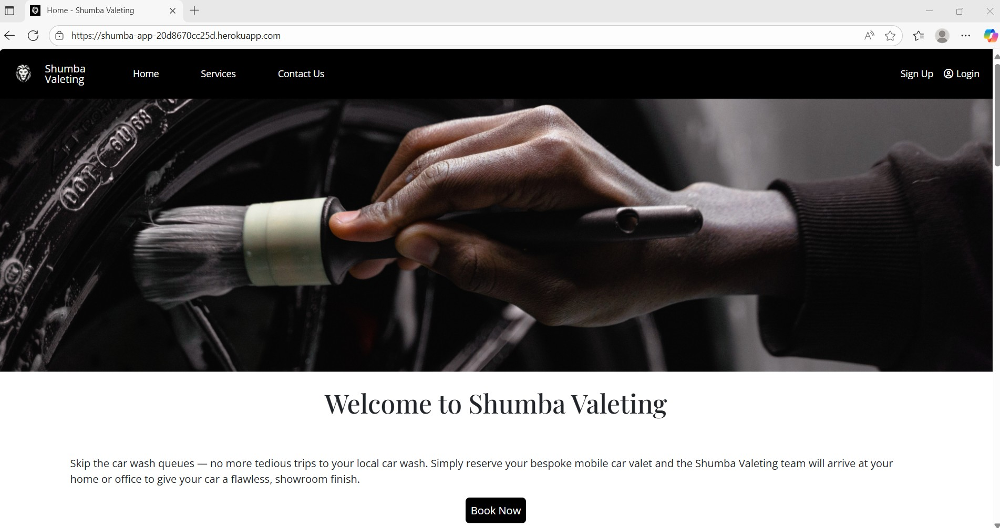

---

## Responsiveness

+ Also checked the website's responsiveness in devtools - Chrome.

    - Small devices:

    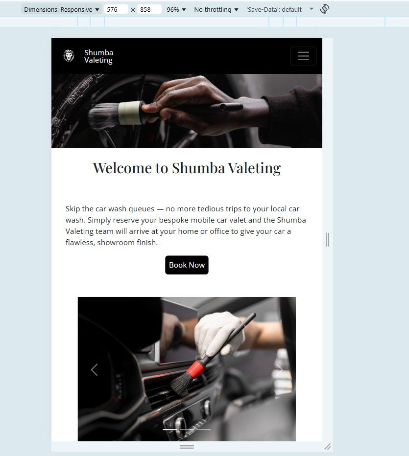

    ---

    - Medium devices:

    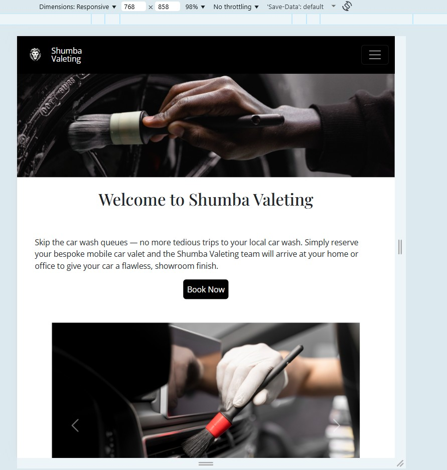

    ---
    
     - large/Xl devices:

    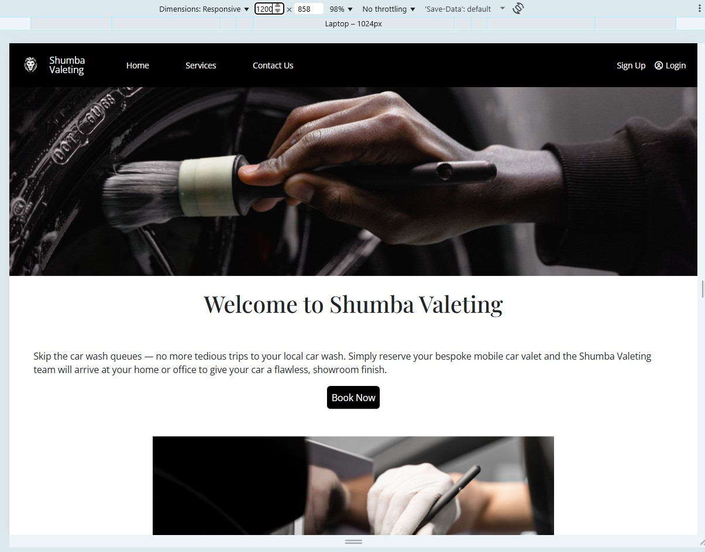
---
## Manual testing

#  User Stories Verification

## Site Users
| User Story        | Test Action                  | Expected Result                                                | Status |
|-------------------|------------------------------|----------------------------------------------------------------|--------|
| View valet packages | Visit `/services`           | All packages (Basic → Luxury) displayed | Yes |
| Make online booking | Visit `/` → submit valid form | Booking saved, success message;               | Yes |
| Receive feedback   | Submit valid/invalid booking/contact forms | Success messages or clear field-level errors                  | Yes |
| Smooth navigation  | Use navbar on mobile/desktop | All links work                        | Yes |
| Input validation   | Submit missing/invalid fields or duplicate slot | Appropriate error messages                        | Yes |

## Site Owner / Admin
| User Story        | Test Action                  | Expected Result                                                | Status |
|-------------------|------------------------------|----------------------------------------------------------------|--------|
| Add/edit/delete services | Django Admin → Services | CRUD operations reflected instantly on `/services`             | Yes |
| Manage bookings   | Django Admin → Bookings       | View/edit/delete entries; unique constraint enforced           | Yes |

---

#  Functional Testing (Manual)

## 2.2 Contact Form
| Case              | Steps                        | Expected Result                          | Result |
|-------------------|------------------------------|------------------------------------------|--------|
| Valid submission  | Fill in fields → Submit      | Record saved; success message            | Yes |
| Invalid email     | Enter `abc@`                 | Email validation error                   | Yes |

---

#  Validation & User Feedback
- Django Forms + model constraints (e.g., unique `date + time_slot`)  
- Django Messages framework provides success/error messages  
- Errors displayed at field level  
- No raw server errors leak to user  

**Examples shown to users:**
- Success: *“Booking confirmed! Thank you.”*  
- Error: *“This time slot is already booked.”*

---

## Validator testing
+ ### HTML

  #### Landing Page
   
    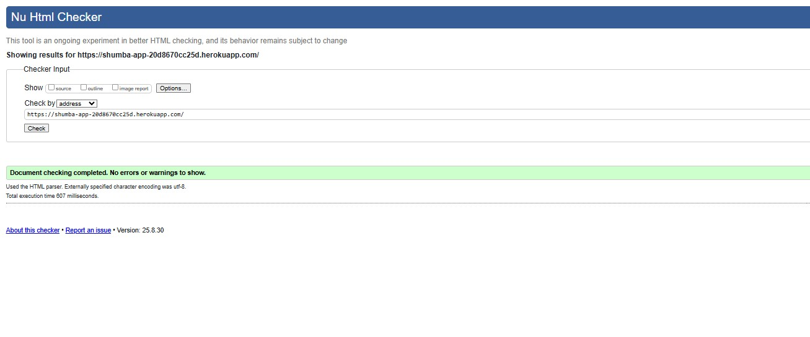.

     - No errors or warnings were found when passing through the official W3C validator.

      #### Vehicle guide Page
   
    .

     - No errors or warnings were found when passing through the official W3C validator.

     #### Contact us Page
   
    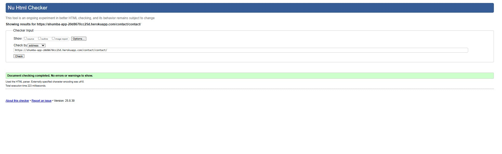.

     - No errors or warnings were found when passing through the official W3C validator.

 #### Contact sucess Page
   
   .

     - No errors or warnings were found when passing through the official W3C validator.

    
+ ### CSS
  No errors or warnings were found when passing through the official W3C (Jigsaw) validator 
    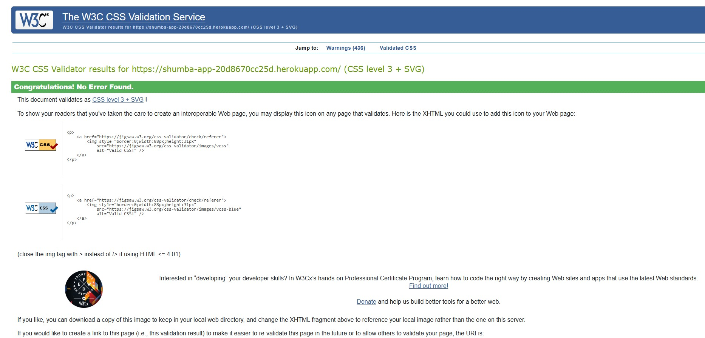

 ---

+ ### JSHint

 No errors or warnings were found when passing through the JS code in JSHint. Only  warnings indicating that the version of JSHint does not support key word 'const' as  this is supported Javascript version ES6. 

   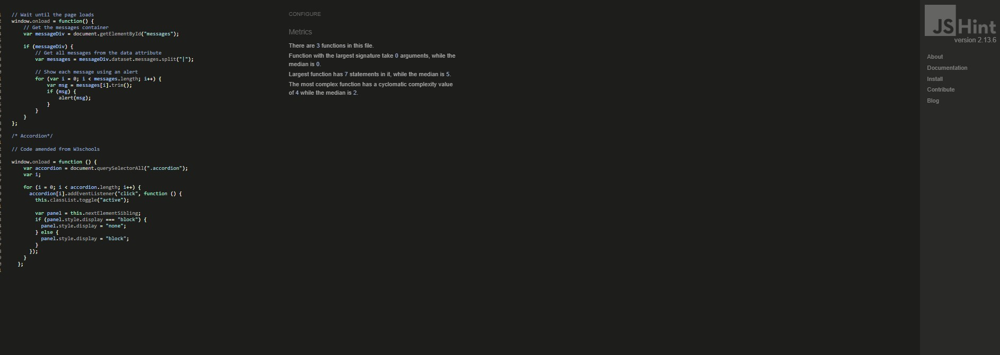

---

## Future improvements

Future development will focus on optimizing the functionality of the pallet calculator so it can calculate stackable pallets and provide vehicle recommendation based on manual length and width input. 

---

 #### Tools

    - [Favicon](https://favicon.io/favicon-converter/) generating an emoji fav icon 
    - [Canva](https://www.canva.com/) Wireframes created in canva
    - Used chatgpt and dev tools to test some of the Javascript code 
  
---

### Credits

All work done by myself - my two accounts MunasheMuk and MunasheMuk2 showing in error in git hub as contributors

## Acknowledgments

- [Code Institute](https://codeinstitute.net/) 

---