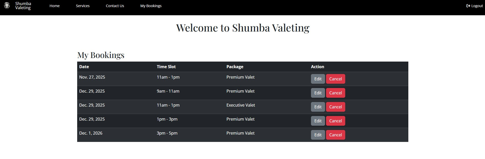

# Shumba Valeting

Shumba valeting is a **Full Stack Django website** designed for **car valeting services**.  
The site allows customers to explore valet packages, make bookings, and contact the business.  
The site has a complete CRUD implementation, responsive design, and database modelling. 

- [Site link](https://shumba-app-20d8670cc25d.herokuapp.com/)

## User Experience (UX)

### User Stories

**As a site user, I want to be able to:**
- Easily view valet packages, so that I can choose the right service for my car.  
- Make an online booking, so that I don’t need to phone the company.  
- Receive confirmation and feedback messages when I submit a booking or contact form.  
- Navigate smoothly across all pages on desktop and mobile, so that I can use the site anywhere.  

**As a site owner, I want to be able to:**
- Add, edit, and delete services and bookings, so that the business can stay up to date.  
- Receive booking requests and customer inquiries directly through the site.  
- Ensure the system validates user input when booking services, so there are no duplicate bookings 
- Provide customers with clear, professional branding in line with Shumba Valeting.  

---

### Purpose and Value of Shumba Valeting to users: 

Shumba Valeting is a **full-stack site** where customers can view packages, make bookings, and contact the business.  

Designed the site so the purpose of the site is **clear to first-time visitors**: it is a **car valeting booking and information platform**, targeting **high-end car owners** who want convenience, professionalism, and a luxury service.  

### Wireframes 

#### Mobile/Tablets/Desktop devices

- [Wireframe link](https://www.canva.com/design/DAGvX6KVp-M/JDVmeQI2DLzMSHCkSxI5jA/view?utm_content=DAGvX6KVp-M&utm_campaign=designshare&utm_medium=link2&utm_source=uniquelinks&utlId=hc1f717e4d3)

### Wireframe Reasoning 

1. The wireframe prioritizes clarity and usability, ensuring users can quickly understand the purpose of Shumba Valeting.

2. Input fields on the booking form are logically grouped to guide the user through step-by-step data entry

3. The  buttons on home page are positioned to work as call to actions 

4. Images added to show users examples of thw work Shumba valeting does

### Colour Scheme
- **Black** – luxury, premium feel  
- **Silver/Grey** – professional, modern tone  
- **White** – clean readability  

### Typography
- **Playfair Display** (headings, luxury branding)  
- **Sans-serif fallback** (body text for readability)  

### Imagery
- High-quality imagery of valeting services is used across the Services page.  
- Each valet package has a dedicated image for visual clarity.  

# Project Features

---

##  Navigation Bar

- Placed at the top of every page, with links to **Home**, **Services**, **Contact**, and **Booking**.  
- Fully responsive across desktop and mobile.  
- On mobile, the navigation bar collapses into a **burger menu** for easier navigation.  

---

##  Home Page

**Features:**

- Brand introduction with clear messaging.  
-  Call-to-action buttons directing users to the **Booking** page.  

---

##  Services Page

**Features:**

- Displays valet packages: **Basic, Premium, Executive, Luxury**.  
- Each package includes descriptions, pricing, and images.  

---

##  Contact Page

**Features:**

- Contact form with fields for user details.  
- Built-in **validation** and error handling.  
- Submit button to send user inquiries.  

---

##  Booking Page

**Features:**

- Booking form connected to the database.  
- Prevents **duplicate time slots** from being booked.  
- Provides **success/error feedback** upon submission.  

---

- **CRUD Operations**:  

  - **Create**: Bookings and messages.  
  - **Read**: Services, bookings, and contact messages.  
  - **Update**: Admin updates booking records and services.  
  - **Delete**: Admin removes bookings or services.  
- **User Feedback**: Django messages framework provides alerts (e.g., “Booking confirmed”, “Time slot already taken”).  
- **Responsive Design**: Works seamlessly across desktops, tablets, and mobiles.  

### Future features to Implement
- Online payments 
- SMS/email booking notifications.  
- Testimonials page.  

## Database Schema

The system uses Django ORM with models mapped to **PostgreSQL (production)**.

### Models

**Contact**
- `name` (CharField)  
- `email` (EmailField)  
- `message` (TextField)  

**Booking**  
- `user` (ForeignKey to Django User, optional for guests)  
- `name` (CharField)  
- `email` (EmailField)  
- `car_make_model` (CharField)  
- `car_reg` (CharField)  
- `package` (ForeignKey to Package)  
- `date` (DateField)  
- `time_slot` (CharField)  
- `created_at` (DateTimeField)  
- `cancelled` (BooleanField)  
- **Unique constraint** on (`date`, `time_slot`) – prevents double booking  

### Schema Characteristics
- One-to-many: `User → Bookings`, `Package → Bookings`.  

---

## Testing

### Manual Testing
- Forms tested with valid/invalid inputs. Validation errors display correctly.  
- Duplicate booking attempts rejected gracefully with error message.  

### CRUD Testing
- Added, updated, and deleted services and bookings via Django Admin.  
- Verified CRUD operations reflected immediately in UI.  

### Responsive Testing
- Tested on desktop, tablet, and mobile (Chrome DevTools).  
- Grid layout adapts correctly.  

### Browser Testing
- Works in Chrome, Firefox, Safari, Edge.  

### Accessibility
- Checked colour contrast with Lighthouse.  
- Semantic HTML (headings, lists, alt text).  

---

## Development Process

- **Version control**: Git & GitHub.  
- **Commit messages**: Small, descriptive, documenting progress.  
- **Process followed**:  
  1. Planning (wireframes, schema design, UX goals).  
  2. Setup (Django project, models, apps, templates).  
  3. Implementation (CRUD, forms, feedback).  
  4. Styling (CSS branding, responsive grid).  
  5. Testing (manual and validation).  
  6. Deployment (local + Heroku).  

---

### Solved bugs

1. Although I had created a superuser locally, I had to recreate the superuser on heroku so the admin panel could show up 

2. The booking form was showing an error like "Select a valid choice" for the package or time slot, even when the options looked right. Amended the packages to make sure they were in the data base, made sure the timeslots were being correctly passed into the form and updated mismatch between my local code and Heroku by updating  models and running migrations properly. (This issue came up because Heroku wasn't deployed on time—I had to wait for my GitHub Student Pack to get free credits for hosting.)

3. Had an issue with fave icons not working with normal links in base.html and so has to use template tags

---

### Unsolved bugs

1. Attempted to have a pop up alert message when there is a duplicate booking but site kept generating a message on the booking for due to the Django auto generated message from errors. Had to resort to using javascript within the home.html where the form is selected to scroll to the form on error. However the issue with the pop up message still stands as won't work. 
---

## Deployment

### Local Deployment
git clone https://github.com/MunasheMuk2/Shumba_valeting.git
cd shumba-valeting
python -m venv venv
venv\Scripts\activate
pip install -r requirements.txt
python manage.py migrate
python manage.py createsuperuser
python manage.py runserver

---

##  Remote Deployment (Heroku)

- Deployed with **Heroku**, using **PostgreSQL** as the database.  
- `Procfile` and `requirements.txt` included for deployment.  
- Environment variables managed in **Heroku Config Vars**.  
- `DEBUG = False` in production for security.  

## Remote Deployment after project completion (Heroku) 
Deployment delays (waiting for GitHub Student Pack credits)

* Step 1: Make Migrations Locally
* Step 2: Push Code to Heroku
* Step 3: Run Migrations on Heroku
* Step 4: Create a Superuser on Heroku
* Step 5: Sync Data (Packages & Time Slots)

---

## Security

- Used **SECRET_KEY** 
- `.gitignore` excludes sensitive files.  
- `DEBUG` disabled in production.  

---

##  Credits

- **Media**: Images sourced from [Unsplash](https://unsplash.com) & chatGPT. 
- **Code References**: code institute and youtube tutorials

# TESTING

## Compatibility

In order to confirm the correct functionality, responsiveness, and appearance:

+ The website was tested on popular browsers : Chrome and Microsoft edge

    - Chrome:

    

     - Microsoft Edge:

    

---

## Responsiveness

+ Also checked the website's responsiveness in devtools - Chrome.

    - Extra small devices:

    

    ---

    - Small devices:

    

    ---

    - Medium devices:

    

    ---
    
     - large/Xl devices:

    
---
## Manual testing

### Site Users
| User Story | Test Action | Expected Result | Status |
|---|---|---|---|
| View valet packages | Visit `/services` | See Basic, Premium, Executive, Luxury cards with price, image, description | ✅ |
| Make online booking | Visit `/` → booking form → submit valid data | Booking saved, success message shown, redirected to Home | ✅ |
| Receive feedback | Submit valid/invalid booking/contact | Success message or field errors; no crash | ✅ |
| Smooth navigation | Use navbar on mobile/desktop | Links to Home/Services/Contact work; active section visible | ✅ |
| Input validation | Submit blank/invalid email; duplicate slot | Form errors shown; duplicate slot rejected with clear message | ✅ |

### Site Owner/Admin
| User Story | Test Action | Expected Result | Status |
|---|---|---|---|
| Add/edit/delete services | Django Admin: Services | Create, update, delete Service; reflected on `/services` | ✅ |
| Manage bookings | Django Admin: Bookings | View, edit, delete; uniqueness enforced | ✅ |
| Consistent branding | Visual inspection across pages | Black/silver theme, typography (Playfair Display), imagery | ✅ |

---

##  Functional Testing (Manual)

### 2.1 Booking Form
| Case | Steps | Expected | Result |
|---|---|---|---|
| Valid booking | Fill required fields (date, time slot, package, name/email if applicable) → Submit | Success message; record saved | ✅ |
| Missing required field | Leave `date` blank → Submit | Field error under `date` | ✅ |
| Invalid email | Enter `test@` → Submit | Email validation error | ✅ |
| Duplicate slot | Create booking for same `date + slot` | Error message: slot already booked | ✅ |
| Unauthenticated user | Not logged in → book | Booking saved (guest) or prompt for minimal info; no crash | ✅ |
| Server error handling | Force IntegrityError (duplicate) | Graceful error; explanatory message; no stack trace to user | ✅ |

### 2.2 Contact Form
| Case | Steps | Expected | Result |
|---|---|---|---|
| Valid submission | Fill name/email/message → Submit | Success message; record saved | ✅ |
| Missing name | Submit empty `name` | Field error shown | ✅ |
| Invalid email | `abc@` | Email validation error | ✅ |

### 2.3 Services Page
| Case | Steps | Expected | Result |
|---|---|---|---|
| Card content | Load `/services` | Image, title, price, bullet list (styled checkmarks optional) | ✅ |
| Image responsiveness | Resize to 320px width | Images scale (`width:100%`, `height:auto`) | ✅ |

## 3 CRUD Coverage

CRUD operations verified through **UI** and **Django Admin**.

| Entity | Create | Read | Update | Delete | UI Reflection |
|---|---|---|---|---|---|
| Service | Admin adds service | Services page lists correctly | Admin edits service | Admin deletes service | Changes visible immediately on `/services` |
| Booking | User submits form | Admin can view; user sees message | Admin edits record/slot | Admin deletes record | Changes reflected: duplicates blocked, messages updated |
| Contact | User submits form | Admin can read | (N/A for user) | Admin deletes | (Back-office only) |

## Validator testing
+ ### HTML

  #### Landing Page
   
    .

     - No errors or warnings were found when passing through the official W3C validator.

      #### Vehicle guide Page
   
    .

     - No errors or warnings were found when passing through the official W3C validator.

     #### Contact us Page
   
    .

     - No errors or warnings were found when passing through the official W3C validator.

 #### Contact sucess Page
   
   .

     - No errors or warnings were found when passing through the official W3C validator.

    
+ ### CSS
  No errors or warnings were found when passing through the official W3C (Jigsaw) validator 
    

 ---

+ ### JSHint

 No errors or warnings were found when passing through the JS code in JSHint. Only  warnings indicating that the version of JSHint does not support key word 'const' as  this is supported Javascript version ES6. 

   

---

