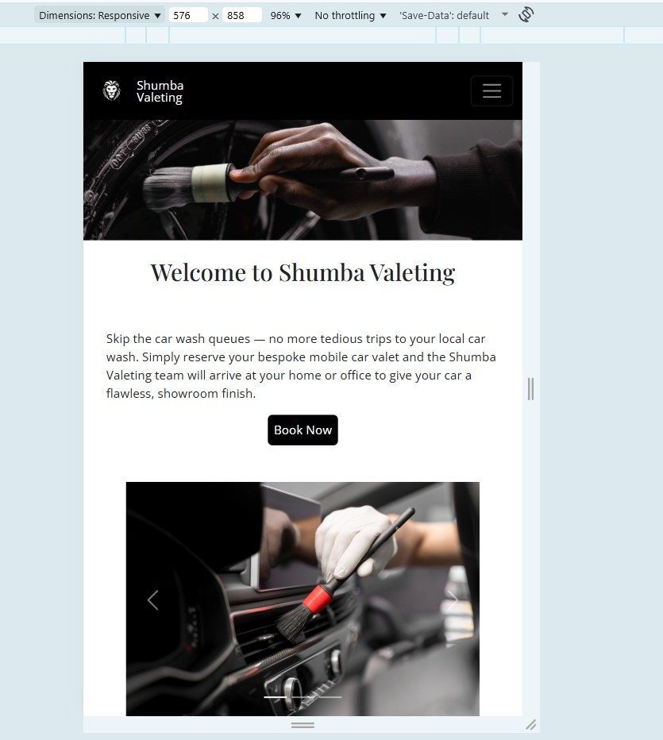
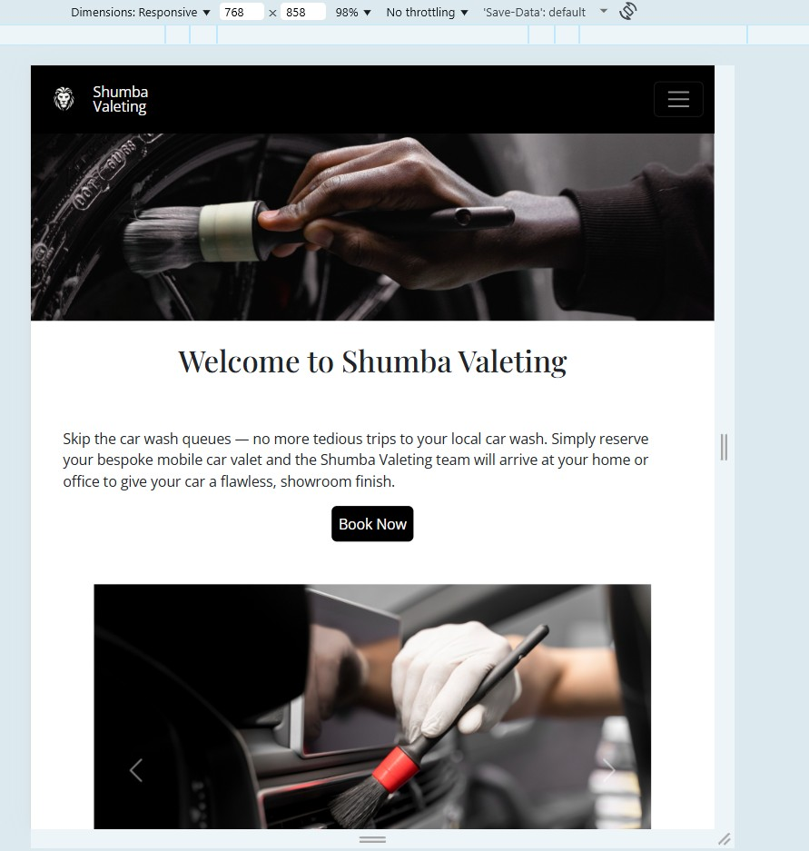
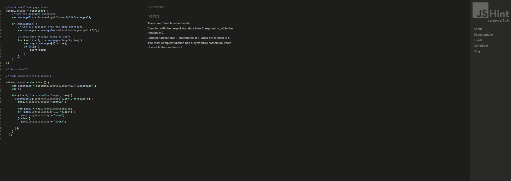

# TESTING

## Compatibility

In order to confirm the correct functionality, responsiveness, and appearance:

+ The website was tested on popular browsers : Chrome and Microsoft edge

    - Chrome:

    

     - Microsoft Edge:

    

---

## Responsiveness

+ Also checked the website's responsiveness in devtools - Chrome.

    - Extra small devices:

    

    ---

    - Small devices:

    

    ---

    - Medium devices:

    

    ---
    
     - large/Xl devices:

    
---
## Manual testing

### Site Users
| User Story | Test Action | Expected Result | Status |
|---|---|---|---|
| View valet packages | Visit `/services` | See Basic, Premium, Executive, Luxury cards with price, image, description | ✅ |
| Make online booking | Visit `/` → booking form → submit valid data | Booking saved, success message shown, redirected to Home | ✅ |
| Receive feedback | Submit valid/invalid booking/contact | Success message or field errors; no crash | ✅ |
| Smooth navigation | Use navbar on mobile/desktop | Links to Home/Services/Contact work; active section visible | ✅ |
| Input validation | Submit blank/invalid email; duplicate slot | Form errors shown; duplicate slot rejected with clear message | ✅ |

### Site Owner/Admin
| User Story | Test Action | Expected Result | Status |
|---|---|---|---|
| Add/edit/delete services | Django Admin: Services | Create, update, delete Service; reflected on `/services` | ✅ |
| Manage bookings | Django Admin: Bookings | View, edit, delete; uniqueness enforced | ✅ |
| Consistent branding | Visual inspection across pages | Black/silver theme, typography (Playfair Display), imagery | ✅ |

---

##  Functional Testing (Manual)

### 2.1 Booking Form
| Case | Steps | Expected | Result |
|---|---|---|---|
| Valid booking | Fill required fields (date, time slot, package, name/email if applicable) → Submit | Success message; record saved | ✅ |
| Missing required field | Leave `date` blank → Submit | Field error under `date` | ✅ |
| Invalid email | Enter `test@` → Submit | Email validation error | ✅ |
| Duplicate slot | Create booking for same `date + slot` | Error message: slot already booked | ✅ |
| Unauthenticated user | Not logged in → book | Booking saved (guest) or prompt for minimal info; no crash | ✅ |
| Server error handling | Force IntegrityError (duplicate) | Graceful error; explanatory message; no stack trace to user | ✅ |

### 2.2 Contact Form
| Case | Steps | Expected | Result |
|---|---|---|---|
| Valid submission | Fill name/email/message → Submit | Success message; record saved | ✅ |
| Missing name | Submit empty `name` | Field error shown | ✅ |
| Invalid email | `abc@` | Email validation error | ✅ |

### 2.3 Services Page
| Case | Steps | Expected | Result |
|---|---|---|---|
| Card content | Load `/services` | Image, title, price, bullet list (styled checkmarks optional) | ✅ |
| Image responsiveness | Resize to 320px width | Images scale (`width:100%`, `height:auto`) | ✅ |

## 3 CRUD Coverage

CRUD operations verified through **UI** and **Django Admin**.

| Entity | Create | Read | Update | Delete | UI Reflection |
|---|---|---|---|---|---|
| Service | Admin adds service | Services page lists correctly | Admin edits service | Admin deletes service | Changes visible immediately on `/services` |
| Booking | User submits form | Admin can view; user sees message | Admin edits record/slot | Admin deletes record | Changes reflected: duplicates blocked, messages updated |
| Contact | User submits form | Admin can read | (N/A for user) | Admin deletes | (Back-office only) |

| feature | action | expected result | tested | passed | comments |
| --- | --- | --- | --- | --- | --- |
| Pallet Data Form | | | | | |
| Number of pallets input | Enter number | number is displayed | Yes | Yes | - |
| Pallet height input | Enter number | number is displayed | Yes | Yes | - |
| Weight per pallet input | Enter number | number is displayed | Yes | Yes | - |
| Select pallet type | Select one of the 2 predifined pallet types  | pallet type is displayed | Yes | Yes | - |
| Buttons | | | | | |
| Calculate button | Click on the calculate button | An output of a vehicle recommendation is displayed | Yes | Yes | - |
| Reset button| Click on the reset button| The pallet data form refreshes all numbers entered by user are reset | Yes | Yes | - |
---

## Validator testing
+ ### HTML
  #### Landing Page
   
    

     - No errors or warnings were found when passing through the official W3C validator.

    
+ ### CSS
  No errors or warnings were found when passing through the official W3C (Jigsaw) validator 
    

 ---

+ ## LightHouse report

    - Lighthouse in devtools confirmed the site has optimal perfoamce. See below: 
    
  ### Home page

  

---

+ ### JSHint

 No errors or warnings were found when passing through the JS code in JSHint. Only 15 warnings indicating that the version of JSHint does not support key word 'const' as  this is supported Javascript version ES6 

   